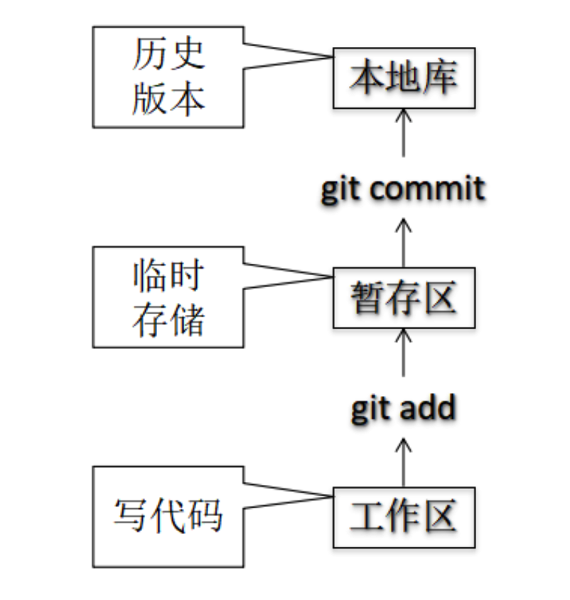
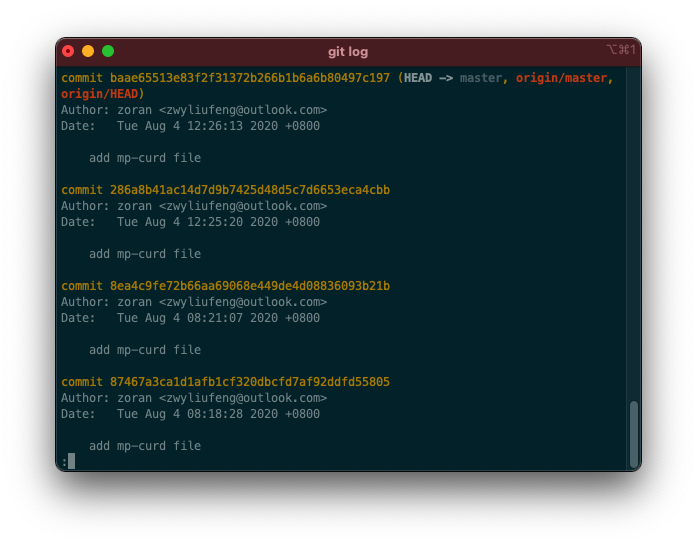
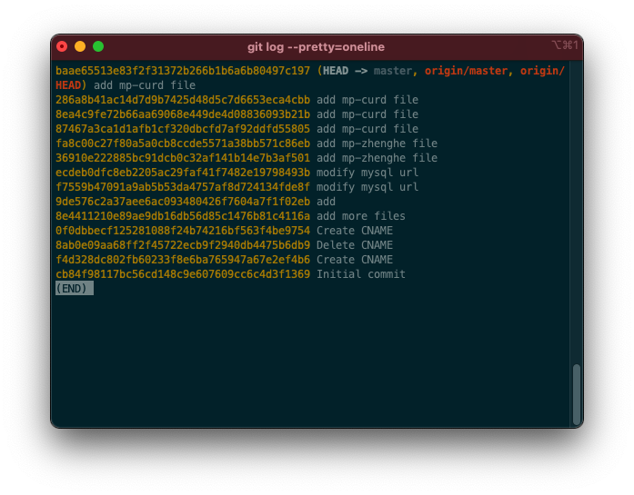
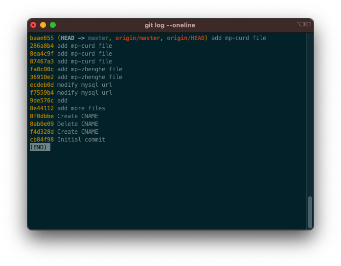
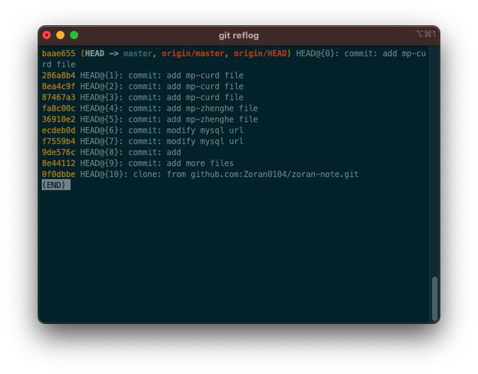

## Git基础配置
+ 签名配置
  + 系统级别：

  ```bash
  git config --global user.name "Zoran"
  git config --global user.email 1195815445@qq.com
  ```
  
  + 项目级别/仓库级别：仅在当前本地库范围内有效
  
  ```bash
   git config user.name tom_pro  
   git config user.email goodMorning_pro@atguigu.com  
   信息保存位置：./.git/config 文件
  ```
  
  > 上述二者的优先级别为就近原则，项目配置优先
  
  

+ 基本操作

  

## 本地库

```bash
git init 		#初始化本地仓库
git status 	#查看工作区、暂存区状态
git commit -m "commit message" [file name] #将暂存区的内容提交到本地库
git commit -a   #修改文件后直接提交不用git add
```

`git log`:



`git log --pretty=oneline`



`git log --oneline`



`git reflog`

